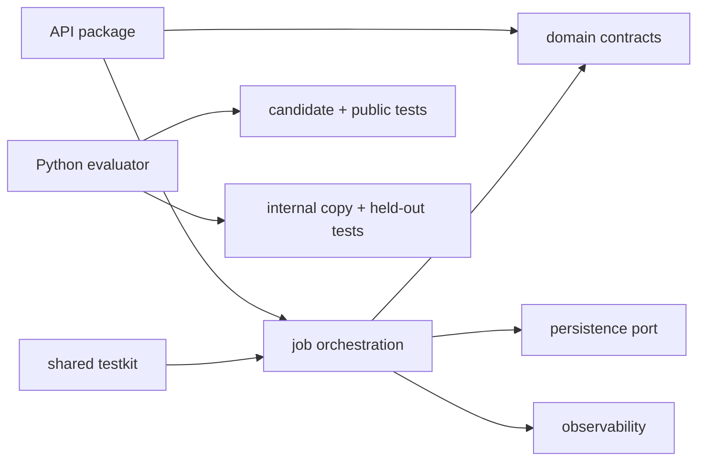

# TypeScript Service Reliability RL Lab

[](https://github.com/Kartikm09/typescript-service-reliability-rl-lab/actions/workflows/ci.yml)
[](LICENSE)

A strict TypeScript content-processing and notification backend plus four reproducible
coding-agent environments. It demonstrates async idempotency, typed contracts, scheduled
delivery, cancellation, layered project references, deterministic test doubles, schema
validation, and benchmark-backed optimization.

**Toolchain:** Node.js 24.18.0 LTS, TypeScript 6.0.3, ECMAScript modules, project
references, ESLint 10, Prettier 3.9.6, c8, Node's test runner, and fast-check.

> Independent proof of work using synthetic code, events, and task fixtures only. No
> employer, customer, or private benchmark commissioned or approved this project.

## Architecture



## Task catalogue

| Task | Engineering work | Evidence |
| --- | --- | --- |
| `task-001` | Repair async idempotency race | concurrent same/different key tests |
| `task-002` | Add scheduled delivery and cancellation | deterministic-clock and retry contract tests |
| `task-003` | Remove circular module dependencies | project-reference and source-boundary checks |
| `task-004` | Optimize schema validation | deterministic parse metric and Node benchmark evidence |

## One-command quick start

```bash
npm ci && make verify-all
```

Start the API with `npm run start:api` or `docker compose up --build`; health is available
at `http://localhost:8084/health`.

## Evaluate a patch

```bash
make evaluate TASK=task-001 PATCH=tasks/task-001/golden/solution.patch
```

The evaluator validates patch scope and runs public checks in a candidate-visible copy.
Held-out tests are compiled only after a separate internal copy is made. Every run emits
`result.json`, `evaluation_report.md`, `test_summary.json`, `changed_files.json`,
`timing.json`, and `score_breakdown.json`.

**Accepted example:** `task-001/golden/solution.patch` shares one in-flight Promise per
key and clears failed entries without serializing distinct keys.

**Rejected example:** `incorrect_patches/prohibited-file.patch` is rejected before
TypeScript compilation with `classification=prohibited_file_change`.

## Quality commands

```bash
npm run format:check
npm run lint
npm run typecheck
npm run build
npm test
npm run test:integration
npm run coverage
npm run benchmark
npm audit --audit-level=high
```

Strict options include `noImplicitAny`, `exactOptionalPropertyTypes`,
`noUncheckedIndexedAccess`, and `noFallthroughCasesInSwitch`.

See the measured [benchmark evidence](reports/benchmark-evidence.md) and final
[Docker verification](reports/docker-verification.md).

## Skills demonstrated

TypeScript, Node.js, strict types, ESM, project references, async concurrency,
idempotency, caching, schema validation, HTTP contracts, deterministic clocks, unit and
integration tests, property testing, coverage, benchmarking, Python evaluation tooling,
Docker, CI/CD, and dependency review.

## Recruiter walkthrough

1. Scan the architecture and task catalogue.
2. Inspect domain contracts, jobs, and async concurrency tests.
3. Compare a task baseline, golden patch, and plausible incorrect patch.
4. Review generated evaluation evidence under `reports/evaluations/`.
5. Read ADRs, CI, security, and release documentation.

## Security and sandbox limitations

The demo bounds request sizes and validates synthetic schemas. Evaluator path checks,
timeouts, and output caps are not a hardened sandbox. Unknown patches should run only in
an externally isolated, credential-free environment.

## Honest limitations

Persistence, transports, and logs are local abstractions; no production database or
external notification provider is claimed. Deterministic work metrics stabilize task
scoring, while wall-clock Node benchmarks remain machine-dependent.
